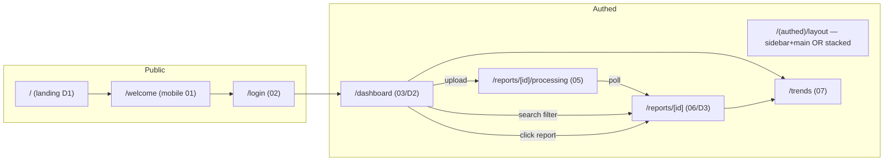
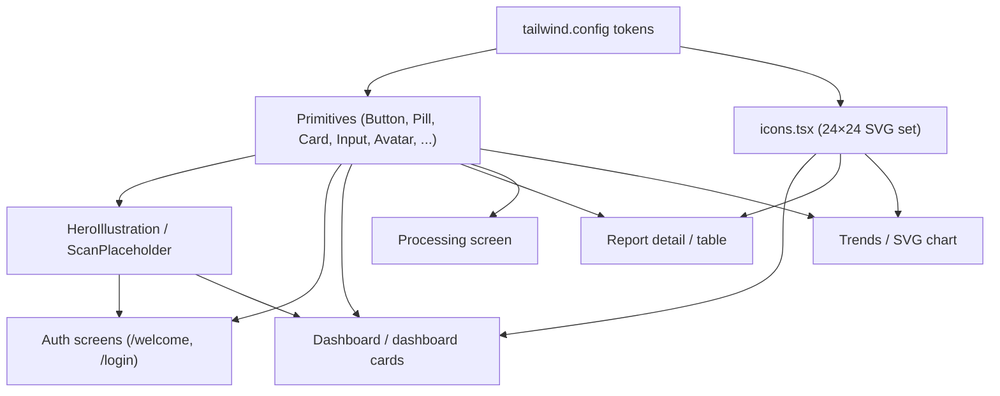
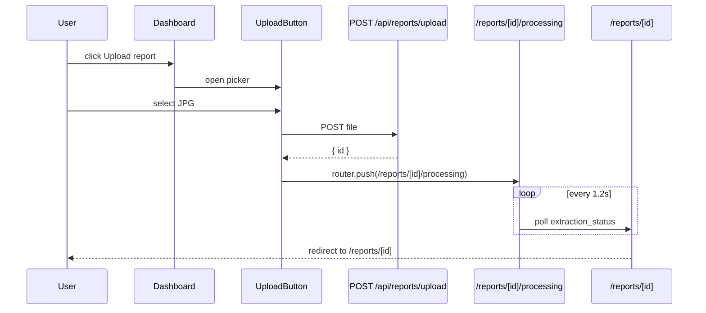

## Plan: Frontend redesign to match the mockup

Rebuild every screen of MedVault to match the bundled HTML mockup, with two responsive layouts per screen (mobile stacked, desktop sidebar-plus-main) and a Tailwind theme driven by the hex tokens the mockup uses (teal `#0E9C90` primary, `#0B7A70` accent, mint `#E3F3F0` surfaces, near-black `#10201E` text). Logo becomes a shared `<Logo/>`. Disclaimer stays inline per screen, not a layout footer.

### Architecture

**Layout decision.** Mobile: single-column scroll, 22–28px page padding, no persistent nav. Desktop (≥1024px): fixed 260px left sidebar (Home / Reports / Trends / Profile + encryption notice pinned bottom) with a flex-1 main area. All cards / buttons / inputs share a small primitive library so the two breakpoints stay in sync.

**Routing.** New routes: `/` (landing D1), `/welcome` (mobile welcome 01), `/reports/[id]/processing` (full-bleed teal 05), `/trends` (07). Existing routes keep their paths: `/login`, `/dashboard`, `/reports/[id]`.

**Theming.** Tailwind config extended with the color/radius/shadow tokens. Inter loaded via `next/font/google` (proper Next way, no `<link>` to fonts.googleapis).

**Icons.** One file, `src/components/icons.tsx`, exporting all the inline SVGs the mockup uses (Camera, Search, ChevronLeft, Plus, ShieldCheck, DocumentLines, Home, ChartLine, Person, Lock, Droplet, Download, Spinner, Check, ChevronDown). All 24×24 viewBox, `stroke-linecap=round`, `stroke-linejoin=round`.

**Disclaimer.** `<Disclaimer/>` primitive repeated at the bottom of dashboard and report detail pages (both mobile and desktop). NOT a layout-wide footer — the mockup positions it inside page padding only on those screens.

### Steps

1. **Design tokens.** Extend `tailwind.config.ts` with brand colors, radii, shadows, Inter family. Add `src/app/globals.css` reset (antialiased, page bg `#F4F8F7`, body font). Set up `next/font/google` for Inter. *(parallel with 2, 3)*

2. **Primitives.** `src/components/Logo.tsx` (teal rounded square + white plus + wordmark). `src/components/Button.tsx` with `variant: "primary" | "secondary" | "ghost"`, `size` for heights 44/48/58/64/66. `src/components/Pill.tsx` (999 radius, mint fg/bg). `src/components/StatusPill.tsx` (per-type tint). `src/components/Input.tsx` (white, 14 radius, 1.5px border). `src/components/Avatar.tsx` (mint circle + initials). `src/components/Card.tsx` (white, 18 radius, subtle shadow). `src/components/EncryptedNotice.tsx` (mint card + shield-lock + copy). `src/components/Disclaimer.tsx`. *(parallel with 1)*

3. **Icon set.** `src/components/icons.tsx` exporting every SVG the mockup needs as 24×24 React components. *(parallel with 1, 2)*

4. **Shared illustrations.** `src/components/HeroIllustration.tsx` (250px mobile / 300px desktop, two tilted white page cards + teal circle with shield-check or plus + orange accent square — param `variant: "shield" | "plus"`). `src/components/ScanPlaceholder.tsx` (diagonal-stripe gradient + "original scan" mono label, configurable size).

5. **Auth layout primitive.** Split `<AuthShell/>` that wraps both `/welcome` and `/login` with the page padding and `ScrollRestoration`. Welcome is the simplified D1 form on mobile + the same layout on desktop (hero illustration sits to the right at ≥1024px).

6. **Welcome screen (`/welcome`).** Mobile 01 + desktop D1 hero. "Get started" → `/login`; "I already have an account" → `/login?mode=signin`.

7. **Login screen (`/login`).** Rewrite `src/app/login/page.tsx`. Segmented control (Sign up | Log in) bound to URL `?mode=`. Email + Password inputs with **Show** link. Encryption notice. Primary CTA (Create account / Log in). Terms fine print. *(depends on 5, 6)*

8. **Authed layout `src/app/(authed)/layout.tsx`.** Become responsive: on mobile, passthrough (just disclaimers where they belong on each page); on desktop, render the 260px sidebar with Home / Reports / Trends / Profile nav, encryption notice pinned bottom, and `{children}` flex-1. Keep the existing auth gate (redirects to `/login` when signed out).

9. **Dashboard page `src/app/(authed)/dashboard/page.tsx`.** Mobile 03 + desktop D2. Greeting row + Avatar + Upload (big) + SearchBar + Partner Hospital simulator + section heading + 1-col/2-col grid of `ReportCard`. Empty state variant when no reports — centered hero (180px) + "No records yet" + Upload CTA. Inline disclaimer at bottom.

10. **ReportCard restyle.** `src/components/ReportCard.tsx`. New: 42×42 tinted icon-tile per type, title + date row, teal "who" line (doctor · clinic), summary line, 18px radius, subtle border + shadow. *(depends on 2, 4 — used by 9)*

11. **SearchBar restyle.** `src/components/SearchBar.tsx`. New visual: 52px (mobile) / 60px (desktop) white input with magnifier icon, no internal grid (live results shown below the bar as the same cards). Behaviour unchanged from the bug-fixed debounce + ref-stable initialReports. *(depends on 10)*

12. **UploadButton restyle.** `src/components/UploadButton.tsx`. New visual: large teal pill with camera icon + 18/700 label, height 66 (mobile) / 60 (desktop), teal glow shadow. Clicking opens a file picker; on submit, push the user to `/reports/[id]/processing` (next step). *(depends on 2)*

13. **Processing screen `src/app/(authed)/reports/[id]/processing/page.tsx`.** Full-bleed `#0E9C90` background, 150×196 scan thumbnail with diagonal stripes, pulsing ring (CSS keyframes, no chart lib), 3-step list — `Scanning the photo` ✓ / `Extracting the data` (spinner) / `Organizing your record`. Poll the `reports` row every 1.2s for `extraction_status`; redirect to `/reports/[id]` when it's `succeeded` or `failed`. *(depends on 12; wired into upload flow from step 12)*

14. **Report detail `src/app/(authed)/reports/[id]/page.tsx`.** Mobile 06 + desktop D3. Top row: back button + title + category pill. Mobile: 96×124 thumbnail beside meta list. Desktop: 440px image column | flex-1 results column. Plain-language callout (mint bg, teal 4px left border, eyebrow "In plain language"). Results table — mobile rows stacked with test name + range + value + status pill, desktop table has explicit column-header row (Test / Value / Normal range / Status). Inline disclaimer at bottom. *(depends on 10, 2)*

15. **Trends `src/app/(authed)/trends/page.tsx`.** Mobile 07 + desktop analog. Lists all test names that repeat across the user's reports. Each gets a chart card: header (test name + latest + delta pill), inline-SVG line chart with optional area fill, y-gridlines + x-axis labels, by-visit list below. Compute the values from `results` JSONB in a server component (no new API route needed; the dashboard already loads the rows). *(depends on 10)*

16. **Partner Hospital simulator button.** Add `POST /api/reports/simulate` (F9 from TASKS.md) which inserts a pre-made sample `ExtractedReport` row with `source='partner_hospital'` and no file. Wire the dashed ghost button on the dashboard to call it then router-refresh. This is the "wow feature" the Done checklist wants. *(depends on 9)*

17. **Polish pass.** Active-state sidebar nav (`Home` highlight when on `/dashboard`). Loading + error states consistent across screens (same red pill style as SearchBar). Focus rings on every interactive element. Spinner on every async button. *(depends on 9–15)*

18. **Verification.** `npm run build` clean. Visual walk-through via dev server on `localhost:3001`: every route loaded at 390px and 1200px widths, sidebar highlights update on navigation, upload → processing → detail flow completes, search filters live, trends chart renders for at least one repeating test, Partner Hospital button inserts a row. *(depends on 1–17)*

### Relevant files
- `tailwind.config.ts` — extend with brand palette, radii, shadows, font family.
- `src/app/globals.css` — base reset, body bg, antialiasing.
- `src/app/layout.tsx` — wire `next/font/google` Inter injection.
- `src/components/Logo.tsx` — **new** rounded teal square + plus glyph + wordmark.
- `src/components/Button.tsx`, `Pill.tsx`, `StatusPill.tsx`, `Input.tsx`, `Avatar.tsx`, `Card.tsx`, `EncryptedNotice.tsx`, `Disclaimer.tsx`, `HeroIllustration.tsx`, `ScanPlaceholder.tsx` — **new** primitives.
- `src/components/icons.tsx` — **new** inline SVG set (Camera, Search, ChevronLeft, Plus, ShieldCheck, DocumentLines, Home, ChartLine, Person, Lock, Droplet, Download, Spinner, Check, ChevronDown).
- `src/app/page.tsx` — rewrite as D1 landing.
- `src/app/welcome/page.tsx` — **new** mobile welcome.
- `src/app/login/page.tsx` — rewrite to match mockup 02.
- `src/app/(authed)/layout.tsx` — responsive sidebar + main split.
- `src/app/(authed)/dashboard/page.tsx` — rewrite to match 03 / D2.
- `src/components/ReportCard.tsx` — restyle.
- `src/components/SearchBar.tsx` — visual refresh.
- `src/components/UploadButton.tsx` — restyle + redirect to processing on submit.
- `src/app/(authed)/reports/[id]/page.tsx` — rewrite to match 06 / D3.
- `src/app/(authed)/reports/[id]/processing/page.tsx` — **new** full-bleed teal processing route.
- `src/app/(authed)/trends/page.tsx` — **new** trends screen.
- `src/app/api/reports/simulate/route.ts` — **new** F9 partner-hospital insert.

### Diagrams

### Verification

1. `npm run build` — type check passes, every route registers.
2. Browser walk-through at `localhost:3001`:
   - 390px viewport: `/`, `/welcome`, `/login`, `/dashboard` (with reports and empty), `/reports/[id]`, `/reports/[id]/processing`, `/trends` all match the mockup.
   - 1200px viewport: same screens, sidebar visible on authed routes, two-column layout on dashboard + report detail, hero illustration visible on landing.
3. Upload → processing → detail flow completes end-to-end on both viewports.
4. `SearchBar` filters live with no console errors and no log-spam (previously-broken loop stays fixed).
5. `Partner Hospital simulator` inserts a row and the dashboard list updates without a hard refresh.
6. `Disclaimer` reads *"MedVault organizes your records. It is not a medical device and does not provide medical advice."* on dashboard and report detail only — not on login.
7. No Tailwind class outside the design tokens; everything colour / radius / shadow / font comes from `tailwind.config.ts`.
