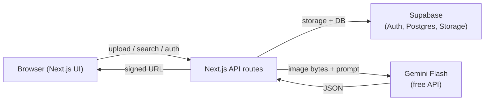

## Plan: Set up `puku.md` + example skill

**TL;DR:** Drop a small `puku.md` at the repo root with only the non-obvious rules (P0-first ordering, never crash on bad AI output, RLS + private storage, env-var contract, mock-extraction demo flag). Reference the existing `docs/` tree via `@docs/...` instead of duplicating it. Add one example skill under `.puku/skills/example/`.

**Steps**
1. **(parallel with 2)** Read `docs/AGENTS.md`, `docs/ARCHITECTURE.md`, `docs/DECISIONS.md`, `docs/DATA_MODEL.md`, `docs/AI_INTEGRATION.md`, `docs/TASKS.md`, `docs/PRD.md` — already loaded in context; re-scan only if anything changed.
2. **(parallel with 1)** Confirm no existing `puku.md`, `PUKU.md`, `AGENTS.md`, `CLAUDE.md`, `.cursorrules`, or `.cursor/rules` exist at root (already verified — only `docs/AGENTS.md` exists, and that's the project's intake doc, not a Puku rule file).
3. Write `puku.md` at the repo root with the strict format from the request. Sections (only the ones that pass the "would removing this cause mistakes?" test):
   - **Quick Reference** — one-line table for the few non-standard commands (e.g. toggling `USE_MOCK_EXTRACTION`, creating the private Supabase bucket, running the RLS SQL). No `npm run dev` etc.
   - **Project Overview** — 1 short paragraph.
   - **Architecture (non-obvious bits only)** — extracted `results` are `jsonb` (no separate table); files served only via **signed URLs**; storage path convention `{user_id}/{report_id}/{filename}`.
   - **Critical Rules** — the things that, if forgotten, break the demo:
     - P0 before P1 before P2 (`@docs/TASKS.md`)
     - Extraction failure must never block upload — always save with `extraction_status="failed"` (`@docs/DECISIONS.md` D6, `@docs/AI_INTEGRATION.md`)
     - Per-user isolation via Supabase RLS — anon key on client, service role **only** on server (`@docs/DATA_MODEL.md`)
     - Never commit `.env`; commit `.env.example`
     - Footer disclaimer: not a medical device, no medical advice (`@docs/PRD.md` §8)
     - Demo safety net: `USE_MOCK_EXTRACTION=true` (`@docs/DECISIONS.md` D9)
   - **External Docs** — `@docs/PRD.md`, `@docs/ARCHITECTURE.md`, `@docs/DATA_MODEL.md`, `@docs/AI_INTEGRATION.md`, `@docs/TASKS.md`, `@docs/DECISIONS.md` (kept inline-on-demand, not duplicated).
4. Create `.puku/skills/example/SKILL.md` with the required frontmatter (`name`, `description`, `when_to_use`) and a minimal body that shows the shape but defers to the (external) skills doc. Add a header comment pointing the team at `docs/features/SKILLS.md`.
5. Do **not** commit — let the user review the diff first.

**Relevant files**
- `puku.md` *(new)* — repo-wide Puku instructions; concise; references `@docs/...`.
- `.puku/skills/example/SKILL.md` *(new)* — starter skill with required frontmatter.
- `docs/AGENTS.md` — **do not modify**; it's the project's human-agent intake doc, separate from Puku's rules.

**Diagrams**

**Verification**
1. `puku.md` exists at repo root, < ~80 lines, every section passes the "removing this causes mistakes" test.
2. `puku.md` contains zero duplicated content from `docs/` — uses `@docs/...` references.
3. `.puku/skills/example/SKILL.md` has valid YAML frontmatter (`name`, `description`, `when_to_use`) and a body.
4. No `git add` / `git commit` performed — review only.
5. No existing files outside the two new ones were touched.
